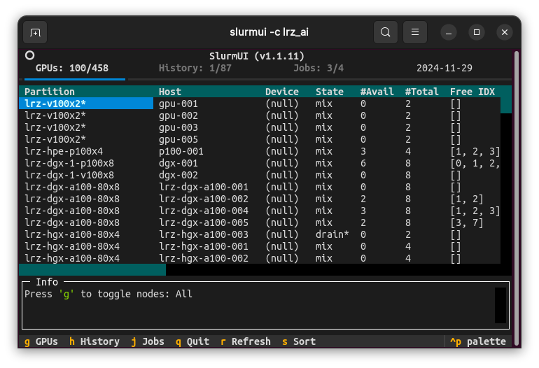
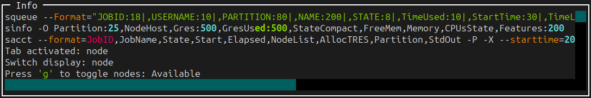

# SlurmUI

Enhanced command-line UI to ease working with slurm. 
Written in Python, derived from [SlurmUI](https://github.com/SirWyver/slurmui).

Viewing and managing
- GPUs
- Jobs in the history
- Jobs in the queue
- Logs for current and past jobs

<div align="center"> 
  
</div>

## Install and run
```shell
pip install -U git+https://github.com/ShenhanQian/slurmui.git
slurmui
```
Optional arguments:
- `-i` update interval in seconds. (10 by default. Set to 0 to disable).
- `-v` verbose mode (printing info and error to the info panel).
- `-r` time range of history jobs to load (1 week by default))
- `-c` cluster name (deprecated as the latest version of SlurmUI does not have cluster-specific configuration).

## Basics
Under the interface of SlurmUI we rely on three basic slurm commands:
- `sinfo` for information of nodes, GPUs, etc.
- `squeue` for current jobs in the queue
- `sacct` for history jobs

Make sure you can get meaningful output from these commands on your cluster before trying SlurmUI.

To debug, you could srun `slurmui` with `-i 0` to disable auto update and `-v` to force verbose logging. Then, you will see the full commands that slurmui sends to slurm in the info panel.

<div align="center"> 
  
</div>

## Supported Clusters
- [TUM CVG](https://cvg.cit.tum.de/)
- [TUM VCG](https://www.niessnerlab.org/)
- [LRZ AI](https://doku.lrz.de/lrz-ai-systems-11484278.html)

> [!NOTE]
> If SlurmUI does not work on your cluster, try the debugging suggestions in [Basics](README.md#basics) and feel free to open an issue.

## Contributions
Open to contribution including but not limited to:
- Improving startup/launch speed
- Enhancing multithreading and concurrency handling
- Strengthening crash recovery and process resiliency
- Expanding features or addressing edge cases
