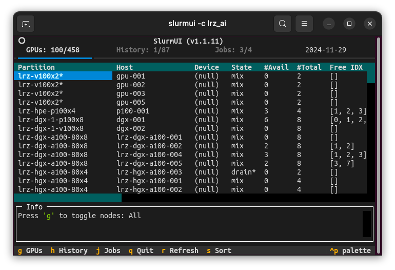

# SlurmUI

Enhanced terminal UI for slurm. Derived from [SlurmUI](https://github.com/SirWyver/slurmui).

Viewing and managing
- GPUs
- Jobs in the history
- Jobs in the queue
- Logs for current and past jobs

<div align="center"> 
  
</div>

## Install
```shell
pip install git+https://github.com/ShenhanQian/slurmui.git
```

## Usage

```shell
slurmui -c <cluster name>
```
Optional arguments:
- `-i` update interval in seconds, 5 by default. Set to 0 to disable.

> [!NOTE]
> Due to the difference between slurm settings, the program can fail when parsing results from `sinfo`. Therefore, you need to specify the cluster name for special cases.

| Cluster | Argument | Comment |
|-|-|-|
| [TUM CVG](https://cvg.cit.tum.de/) | | Works with the default setting. |
| [TUM VCG](https://www.niessnerlab.org/) | `-c tum_vcg` | Formats of Gres and GresUsed are different. |
| [LRZ AI](https://doku.lrz.de/lrz-ai-systems-11484278.html) | `-c lrz_ai` | Formats of Gres and GresUsed are different. |

For other clusters, you can first try running `slurmui` without arguments. If failed, you will need to add if-else sentences for your special cases. 

## Troubleshooting
- ### `AttributeError: 'NoneType' object has no attribute 'groups'`

    Search in the repository for places where `sinfo` is called with the output format specifies like `-O 'Partition:25,NodeHost,Gres:80,GresUsed:80,StateCompact,FreeMem,CPUsState'`. The width for some items(s) may not be enough, causing a problem to splitting the string into columns.
